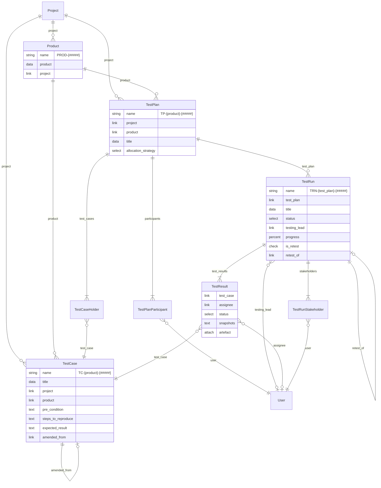
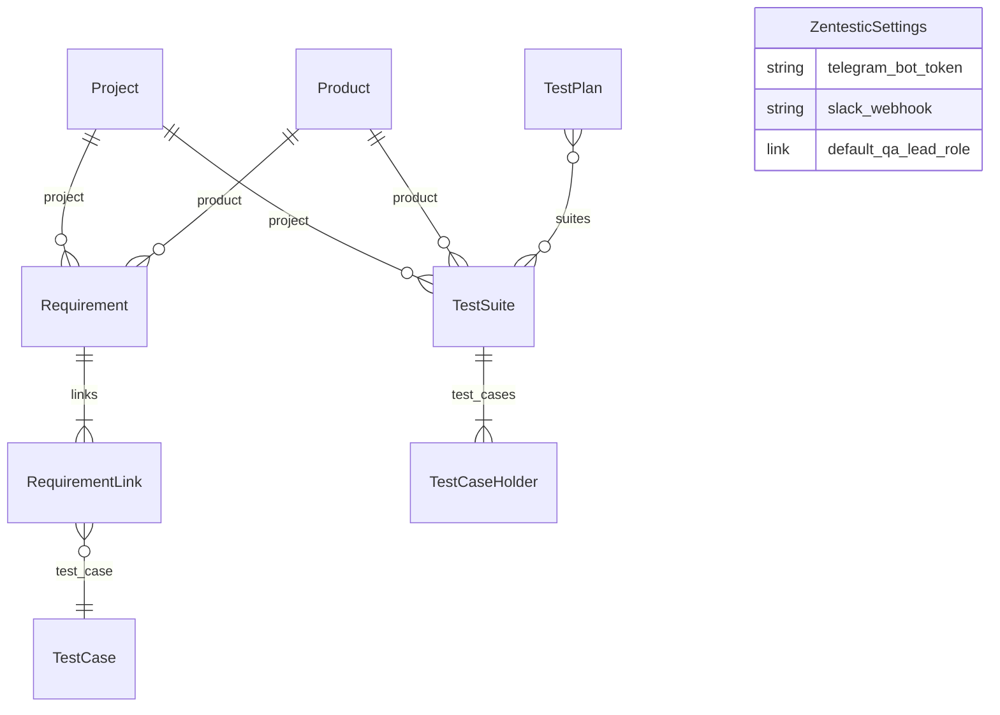

# Developer Notes

## Data Model

Zentestic is a Frappe app on ERPNext v15. **`Project`** and **`User`** are standard platform DocTypes; everything below lives under `zentestic/zentestic/doctype/`.

### ER diagram (implemented)



**Child tables** (Frappe `istable` — rows owned by the parent, no standalone permissions):

| DocType | Parent | Link field |
|---------|--------|------------|
| Test Case Holder | Test Plan | `test_case` → Test Case |
| Test Plan Participant | Test Plan | `user` → User |
| Test Result | Test Run | `test_case` → Test Case; `assignee` → User |
| Test Run Stakeholder | Test Run | `user` → User |

**Execution flow:** `Project → Product → Test Case` (library) and `Test Plan → Test Run → Test Result` (planning & execution). Test Results snapshot case fields at run time (`pre_condition`, `steps_to_produce`, `expected_result`) so later case edits do not alter historical runs.

### ER diagram (planned — see ROADMAP.md)



| DocType | Phase | Notes |
|---------|-------|-------|
| **Test Suite** | 2 (optional) | Reusable case collection; Test Plan may link suites instead of ad-hoc holders |
| **Requirement** | 3 | `REQ-{project}-{#####}`; title, description, priority, status, optional `external_id` |
| **Requirement Link** | 3 | Child table on Test Case for many-to-many req ↔ case traceability |
| **Zentestic Settings** | 7 | Singleton for Telegram, Slack, default roles (replaces site config) |

Phase 2 may also add **tags** (Frappe Tag vs custom child table — open question in ROADMAP).

## Installation

### Frappe Bench

```bash
cd $PATH_TO_YOUR_BENCH
bench get-app $URL_OF_THIS_REPO --branch develop
bench install-app zentestic
```

### Docker Compose

```bash
docker compose up -d --build
```

Open [http://localhost:8080](http://localhost:8080) and log in as `Administrator` with the password from `.env` (`ADMIN_PASSWORD`, default `admin`).

During first boot, MariaDB may log warnings like `Aborted connection ... (Got an error reading communication packets)`. Those are expected when `create-site` closes its DB connection. Site creation succeeded if you also see `Scheduler is resumed for site frontend` and `create-site` exits with code `0`.

Quick health check:

```bash
docker compose ps
docker compose exec backend bench --site frontend list-apps
curl -sS -o /dev/null -w '%{http_code}\n' http://localhost:8080/api/method/frappe.ping
```

If login or the API fails with `Access denied for user '_…'@'<container-ip>'`, the MariaDB site user is bound to an old container IP. Either wipe volumes (`docker compose down -v` then `docker compose up -d --build`) or rename that user to host `%` inside the `db` container.

## Seed Demo Data

Creates a comprehensive demo graph for local QA / UI testing:

- **Users:** QA lead, 3 testers, Android tester, stakeholder, product owner (`*@zentestic.demo`)
- **Projects:** `Zentestic Demo`, `Mobile App QA`, `Platform API QA`
- **Products:** Billing Portal, Customer Portal, Admin Console, Internal Tools (no plans), iOS / Android Companion App, Payments API, Notifications Service
- **Test Plans:** Round Robin + Random; 1–4 participants; plans with no runs yet (ready to start in UI)
- **Test Runs:** Draft, In Progress, Completed; in-progress / completed / chained retests (Fail/Blocked carry-forward)
- **Results:** Pending, Pass, Fail, Blocked, Retest, In progress — with snapshots, actual results, and explicit assignees
- **Edge cases:** minimal test case (title only), unplanned backlog cases, single-participant plans, 100% all-pass runs

```bash
# Local bench
bench --site <site> execute zentestic.zentestic.seed.run

# Docker Compose (SITE_NAME from .env, default frontend)
docker compose exec backend bench --site frontend execute zentestic.zentestic.seed.run
```

Re-runs are idempotent (existing demo docs are reused). To delete and recreate the demo graph:

```bash
bench --site <site> execute zentestic.zentestic.seed.run --kwargs '{"reset": true}'
```

Docker Compose bind-mounts the app into backend services, so local `seed.py` changes are visible after a restart. If the module is still missing (for example after a fresh clone before the mount was added), rebuild and recreate:

```bash
docker compose up -d --build
```

A `NameError: name 'zentestic' is not defined` from `bench execute` usually means the seed module was not found (Frappe falls back to `eval`). Confirm the file exists in the container, and call the path **without** parentheses — do not paste `zentestic.zentestic.seed.run()` into `bench console` without importing first:

```bash
docker compose exec backend ls apps/zentestic/zentestic/zentestic/seed.py
```

```python
# bench console
from zentestic.zentestic.seed import run
run()
```

## Contributing

This app uses `pre-commit` for code formatting and linting. Please [install pre-commit](https://pre-commit.com/#installation) and enable it for this repository:

```bash
cd apps/zentestic
pre-commit install
```

Pre-commit is configured to use the following tools for checking and formatting your code:

- ruff
- eslint
- prettier
- pyupgrade
