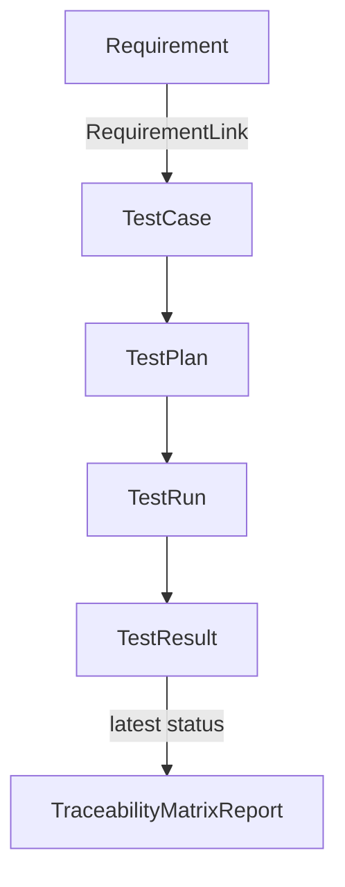
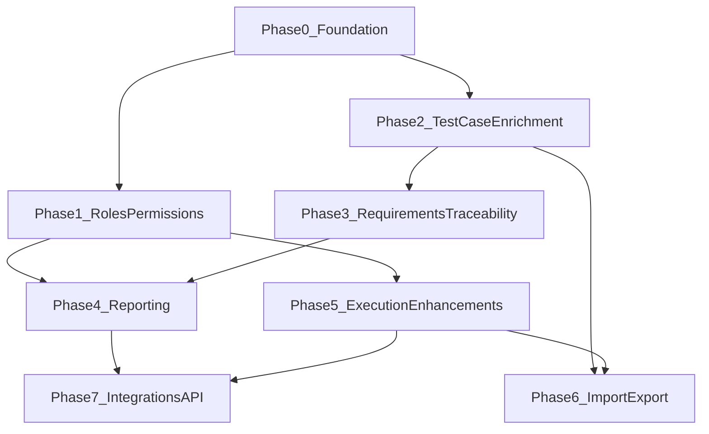

# Zentestic Roadmap

Zentestic is a Test Case Management System built as a Frappe/ERPNext v15 app. This document captures the gap analysis against standard TCMS capabilities, known technical debt, and a phased implementation plan.

## Maturity Summary

| Milestone | Approx. TCMS Coverage | Target Audience |
|-----------|----------------------|-----------------|
| **v0.0.1 (current)** | ~40% — core plan → run → execute → retest workflow | Early adopters, demo/evaluation |
| **After Phase 0–4** | ~75% — roles, enriched cases, traceability, reporting | Single-org QA teams in production |
| **After Phase 5–7** | ~90% — execution polish, bulk ops, integrations | Competitive lightweight TCMS |

## Platform Constraints

These decisions are fixed for the roadmap horizon:

- **UI:** Frappe Desk only — extend DocTypes, workspaces, reports (no custom SPA)
- **Platform:** Keep ERPNext dependency for the `Project` entity
- **Tenancy:** Single organization per install
- **Early priorities:** Roles & permissions → Requirements & traceability → Reporting

---

## Current State

### What Works Today

Zentestic (v0.0.1) delivers a functional end-to-end testing workflow:

```
Project (ERPNext) → Product → Test Case
                            → Test Plan → Test Run → Test Result
                                              ↓
                                        Schedule Retest
```

| Capability | Status | Key Files |
|------------|--------|-----------|
| Product hierarchy (Project → Product) | Implemented | `zentestic/zentestic/doctype/product/` |
| Test case CRUD + import | Implemented | `zentestic/zentestic/doctype/test_case/` |
| Test plans with case selection + participants | Implemented | `zentestic/zentestic/doctype/test_plan/` |
| Round robin / random allocation | Implemented | `test_plan.js`, `test_plan.py` |
| Test runs with result tracking | Implemented | `zentestic/zentestic/doctype/test_run/` |
| Result snapshots + artefact attachments | Implemented | `test_run.py`, `test_result.json` |
| Retest with fail/blocked carry-forward | Implemented | `test_run.js`, `test_run.py` |
| Progress auto-calculation | Implemented | `test_run.js` |
| Workspace + 1 analytics chart | Implemented | `workspace/zentestic/`, `report/breakdown_of_test_runs/` |
| Demo seed data | Implemented | `zentestic/zentestic/seed.py` |
| Telegram notifications | Partial | `test_run.py` (requires site config) |

### README vs Reality

The README claims QA leads, testers, and stakeholders "each have a clear view of progress." Today, assignment fields exist (`Test Plan Participant`, `Test Result.assignee`, `Test Run Stakeholder`) but **role-based permissions and scoped views are not implemented** — all Zentestic DocTypes grant access only to `System Manager`.

---

## TCMS Gap Analysis

Comparison against capabilities expected in a complete Test Case Management System.

| Area | Standard TCMS Expectation | Zentestic Status |
|------|---------------------------|------------------|
| **Test case library** | CRUD, folders/suites, tags, priority, type, lifecycle status | **Partial** — CRUD + import only; `test_case.json` has title, steps, expected result |
| **Test suites** | Reusable case collections independent of runs | **Missing** — Test Plan doubles as suite; no standalone Suite DocType |
| **Test plans/cycles** | Scheduling, milestones, environments, plan status | **Partial** — cases + participants + allocation; no dates/env/milestones |
| **Test execution** | Run tracking, step-level results, environments, bulk update | **Partial** — case-level status, snapshots, artefacts, retest; no env/build/step-level |
| **Requirements** | User stories, traceability matrix (req ↔ case ↔ result) | **Missing** |
| **Defect tracking** | Built-in bugs or issue tracker link | **Missing** |
| **Roles & permissions** | QA Lead, Tester, Stakeholder scoped views | **Missing** — System Manager only; README claim not implemented |
| **Reporting** | Pass/fail trends, coverage, tester workload, exports | **Partial** — 1 status pie chart; Telegram HTML summary in `test_run.py` |
| **Search & filter** | Tags, full-text, saved filters, "My assigned tests" | **Partial** — Frappe list filters only; no custom list JS in `hooks.py` |
| **Import/export** | Bulk import for cases, plans, runs; PDF/Excel export | **Partial** — Test Case import only |
| **Notifications** | Email, Slack, in-app; stakeholder alerts | **Partial** — Telegram optional; stakeholders stored but not notified |
| **Integrations** | Jira, CI/CD (JUnit), webhooks | **Missing** |
| **API** | Documented REST + custom endpoints | **Partial** — Frappe default API + 2 whitelisted methods |
| **Audit/versioning** | Case history, approved versions | **Partial** — `amended_from` field exists but DocType not submittable |
| **Automation** | Automated test result ingestion | **Missing** |
| **Multi-tenancy** | Company/org isolation | **N/A** — single-org target |

---

## Technical Debt

Issues to resolve in Phase 0 before adding new features.

| # | Issue | Location | Impact |
|---|-------|----------|--------|
| 1 | **Duplicate run-creation paths** — UI uses client-side `frappe.new_doc`; server has unused `start_test_run()` | `test_plan.js`, `test_plan.py` | Inconsistent behavior, harder to test |
| 2 | **Schema mismatch** — `test_plan.py` sets `project`/`product` on Test Run, but Test Run schema has no such fields | `test_plan.py`, `test_run.json` | Dead code / silent field drops |
| 3 | **Empty controllers** — business logic concentrated in 2 DocTypes; others are stubs | `test_case.py`, `test_*.py` | No validation, no unit test coverage |
| 4 | **Permission hooks commented out** — no `permission_query_conditions` or custom auth | `hooks.py` | Blocks role-based access |
| 5 | **Versioning stub** — `amended_from` on Test Case without submittable workflow | `test_case.json` | Misleading schema |

---

## Phased Implementation

### Phase 0: Foundation & Consistency

**Status:** Not Started  
**Depends on:** —  
**Estimated effort:** 1–2 weeks

**Goal:** Establish a stable, testable base for all later phases.

**Deliverables:**

- [ ] Unify Test Run creation on server-side `start_test_run()`; simplify `test_plan.js` to call it
- [ ] Fix Test Run schema — add `project`/`product` links derived from Test Plan, or remove dead assignments in Python
- [ ] Add unit tests for allocation (round robin/random), snapshot population, retest carry-forward
- [ ] Document Telegram config (`telegram_bot_token`, `telegram_chat_id`) in `DEVNOTES.md`
- [ ] Enable app in Desk — uncomment `add_to_apps_screen` in `hooks.py`

**Key files:**

- `zentestic/zentestic/doctype/test_plan/test_plan.js`
- `zentestic/zentestic/doctype/test_plan/test_plan.py`
- `zentestic/zentestic/doctype/test_run/test_run.json`
- `zentestic/zentestic/doctype/test_run/test_run.py`
- `zentestic/zentestic/doctype/test_run/test_test_run.py`
- `zentestic/hooks.py`
- `DEVNOTES.md`

**Acceptance criteria:**

- Starting a test run from a plan uses a single server-side code path
- Test Run records correctly inherit project/product from the plan
- Unit tests pass for allocation, snapshots, and retest logic
- App appears in Frappe apps screen with logo and route

---

### Phase 1: Roles & Permissions

**Status:** Not Started  
**Depends on:** Phase 0  
**Estimated effort:** 2–3 weeks  
**Priority:** High

**Goal:** Match the README promise — QA leads, testers, and stakeholders each have a clear view.

**Deliverables:**

- [ ] Custom Roles (Frappe Role fixtures): `QA Lead`, `Tester`, `Stakeholder`, `Zentestic Admin`
- [ ] DocType permissions on Product, Test Case, Test Plan, Test Run — replace System-Manager-only in each `*.json`
- [ ] Row-level scoping via `permission_query_conditions` in `hooks.py`:
  - Testers: read/update assigned Test Results / runs they participate in
  - Stakeholders: read-only on runs where listed in `Test Run Stakeholder`
  - QA Lead: full CRUD within assigned projects
- [ ] Role-specific workspaces under `workspace/zentestic/`:
  - **Tester:** "My Assigned Tests" filtered list (Test Run where assignee = current user)
  - **Stakeholder:** completed runs + progress charts (read-only)
  - **QA Lead:** full Manage + Review sections
- [ ] Update `seed.py` to assign demo roles (not all System Manager)

**Key files:**

- `zentestic/hooks.py`
- `zentestic/zentestic/doctype/*/*.json` (permissions sections)
- `zentestic/zentestic/workspace/zentestic/zentestic.json`
- `zentestic/zentestic/seed.py`
- New: `zentestic/fixtures/role.json` (or equivalent fixture)

**Acceptance criteria:**

- Demo users log in with role-appropriate access (no System Manager required for daily QA work)
- Tester sees only their assigned test results
- Stakeholder can view run progress but cannot edit results
- QA Lead can create plans, start runs, and manage cases within their projects

---

### Phase 2: Test Case Enrichment

**Status:** Not Started  
**Depends on:** Phase 0  
**Estimated effort:** 2–3 weeks

**Goal:** Bring the test library up to TCMS baseline before traceability work.

**Deliverables:**

- [ ] Extend `test_case.json` with:
  - `priority` — Critical / High / Medium / Low
  - `status` — Draft / Review / Approved / Deprecated
  - `test_type` — Manual / Automated
  - `tags` — child table or Frappe Tag link
  - `module` or `section` — Data field for grouping
- [ ] Optional: **Test Suite** DocType — reusable case collection; Test Plan links to Suite(s) instead of ad-hoc child rows
- [ ] Test Case list enhancements — custom list JS via `doctype_list_js` in hooks (color-coded priority, filter by tag/status)
- [ ] Clone test case server method + form button
- [ ] Update import template for new fields

**Key files:**

- `zentestic/zentestic/doctype/test_case/test_case.json`
- `zentestic/zentestic/doctype/test_case/test_case.js`
- `zentestic/zentestic/doctype/test_case/test_case.py`
- `zentestic/hooks.py`
- New (optional): `zentestic/zentestic/doctype/test_suite/`

**Acceptance criteria:**

- Test cases can be filtered and sorted by priority, status, and tags in list view
- Approved cases are distinguishable from draft/deprecated in the UI
- Clone creates a new case with copied content and Draft status
- Import/export includes all new metadata fields

---

### Phase 3: Requirements & Traceability

**Status:** Not Started  
**Depends on:** Phase 2  
**Estimated effort:** 3–4 weeks  
**Priority:** High

**Goal:** Link requirements to test cases and prove coverage.

**Deliverables:**

- [ ] New DocType **Requirement** (`REQ-{project}-{#####}`):
  - Fields: title, description, project, product, priority, status (Draft / Approved / Implemented / Verified)
  - Optional `external_id` for future Jira sync
- [ ] Child table **Requirement Link** on Test Case (many-to-many)
- [ ] **Traceability Matrix** Query Report:
  - Rows: Requirements
  - Columns: linked Test Cases
  - Cells: latest execution status from most recent completed Test Run
- [ ] **Coverage report:** % requirements with ≥1 approved test case; % with passing latest result
- [ ] Workspace shortcut: "Traceability Matrix" under Review section

**Data flow:**



**Key files:**

- New: `zentestic/zentestic/doctype/requirement/`
- New: `zentestic/zentestic/doctype/requirement_link/`
- `zentestic/zentestic/doctype/test_case/test_case.json`
- New: `zentestic/zentestic/report/traceability_matrix/`
- New: `zentestic/zentestic/report/requirement_coverage/`
- `zentestic/zentestic/workspace/zentestic/zentestic.json`

**Acceptance criteria:**

- Requirements can be created and linked to multiple test cases
- Traceability Matrix shows requirement ↔ case ↔ latest result status
- Coverage report calculates % requirements covered and % passing
- Only Approved test cases count toward coverage metrics

---

### Phase 4: Reporting & Analytics

**Status:** Not Started  
**Depends on:** Phase 1, Phase 3  
**Estimated effort:** 2–3 weeks  
**Priority:** High

**Goal:** Actionable quality visibility beyond a single pie chart.

**Deliverables:**

- [ ] New Query Reports under `zentestic/zentestic/report/`:
  - Pass/Fail/Blocked trend over time (by Test Run completion date)
  - Test Run summary (cases total, pass rate, blocked rate, retest count)
  - Tester workload (assigned vs completed per user)
  - Product/project quality dashboard (pass rate by product)
  - Requirement coverage (from Phase 3)
- [ ] Dashboard charts linked in `zentestic_dashboard/`
- [ ] Run completion report — Print Format for Test Run (PDF via Frappe) with results table + summary stats
- [ ] Expand workspace Analytics section with chart shortcuts + date filters
- [ ] Wire stakeholder workspace to read-only dashboard views

**Key files:**

- New: `zentestic/zentestic/report/pass_fail_trend/`
- New: `zentestic/zentestic/report/test_run_summary/`
- New: `zentestic/zentestic/report/tester_workload/`
- New: `zentestic/zentestic/report/product_quality/`
- New: `zentestic/zentestic/print_format/test_run_report/`
- `zentestic/zentestic/dashboard_chart/`
- `zentestic/zentestic/zentestic_dashboard/zentestic/zentestic.json`
- `zentestic/zentestic/workspace/zentestic/zentestic.json`

**Acceptance criteria:**

- Dashboard shows at least 4 charts beyond the existing status breakdown
- Reports support date range filtering
- Test Run PDF export includes all results with pass/fail summary
- Stakeholder role can access reports without edit permissions

---

### Phase 5: Execution Enhancements

**Status:** Not Started  
**Depends on:** Phase 1  
**Estimated effort:** 2–3 weeks

**Goal:** Richer test run context and improved tester productivity.

**Deliverables:**

- [ ] Test Run fields: `environment`, `build_version`, `start_date`, `end_date`
- [ ] Test Plan fields: `planned_start`, `planned_end`, `description`
- [ ] Bulk status update on Test Result grid (client script + whitelisted method)
- [ ] "My Tests" execution view — filtered Test Run form or list view for current assignee
- [ ] Stakeholder email notification on run completion (Frappe Notification / Email Alert)
- [ ] Optional: `issue_url` field on Test Result for failed cases (prep for Phase 7 Jira)

**Key files:**

- `zentestic/zentestic/doctype/test_run/test_run.json`
- `zentestic/zentestic/doctype/test_run/test_run.js`
- `zentestic/zentestic/doctype/test_plan/test_plan.json`
- `zentestic/zentestic/doctype/test_result/test_result.json`

**Acceptance criteria:**

- Test runs record environment and build version
- Tester can bulk-mark assigned results as Pass/Fail from the grid
- Stakeholders receive email when a run they are listed on completes
- Failed results can link to an external issue URL

---

### Phase 6: Import/Export & Bulk Operations

**Status:** Not Started  
**Depends on:** Phase 2, Phase 5  
**Estimated effort:** 1–2 weeks

**Goal:** Efficient data movement for teams migrating or operating at scale.

**Deliverables:**

- [ ] Enable `allow_import` on Test Plan (with validation)
- [ ] Export Test Run results to CSV/Excel (Query Report export + Print Format)
- [ ] Bulk assign/reassign testers on Test Run
- [ ] Test Case export with all metadata fields

**Key files:**

- `zentestic/zentestic/doctype/test_plan/test_plan.json`
- `zentestic/zentestic/doctype/test_run/test_run.js`
- `zentestic/zentestic/doctype/test_case/test_case.json`

**Acceptance criteria:**

- Test Plans can be imported via Frappe Data Import with case/participant validation
- Test Run results exportable to CSV with all columns
- QA Lead can reassign multiple test results to a different tester in one action

---

### Phase 7: Integrations & API

**Status:** Not Started  
**Depends on:** Phase 4, Phase 5  
**Estimated effort:** TBD (deferred)

**Goal:** External system connectivity for CI/CD pipelines and issue trackers.

**Deliverables:**

- [ ] Zentestic Settings DocType (Telegram, Slack webhook, default roles)
- [ ] CI/CD result import endpoint (JUnit XML → Test Results)
- [ ] Jira issue link/sync for failed tests
- [ ] Webhook on Test Run completion
- [ ] OpenAPI doc for whitelisted methods

**Key files:**

- New: `zentestic/zentestic/doctype/zentestic_settings/`
- New: `zentestic/api/` (or whitelisted methods in existing controllers)
- `zentestic/hooks.py`

**Acceptance criteria:**

- Settings configurable from Desk without editing site config
- JUnit XML upload creates/updates Test Results on an existing run
- Failed test results can create or link Jira issues
- Webhook fires on run completion with run summary payload

---

## Out of Scope (For Now)

The following are explicitly deferred given platform and deployment constraints:

| Item | Reason |
|------|--------|
| Custom SPA frontend (React/Vue) | Frappe Desk is the chosen UI platform |
| Multi-company / SaaS multi-tenancy | Single-org deployment model |
| Built-in defect/bug tracker | Use external issue URL + Phase 7 Jira integration instead |
| Step-level execution UI | Case-level execution is sufficient for v1 |
| Removing ERPNext dependency | Project entity and ERPNext ecosystem are intentional |
| Real-time collaborative editing | Frappe standard form locking is sufficient |

---

## Open Questions

Decisions to resolve before or during later phases:

1. **Test Suite vs Test Plan** — Should Phase 2 introduce a standalone Test Suite DocType, or extend Test Plan with suite-like features (templates, reuse)?
2. **Requirement source of truth** — Will requirements be authored in Zentestic only, or synced from an external tool (Jira, Confluence)?
3. **Tag implementation** — Frappe built-in Tag DocType vs custom child table with project-scoped tag names?
4. **Project-scoped permissions** — Should QA Lead access be tied to ERPNext Project assignment, or a separate Zentestic project membership table?
5. **CI/CD integration scope** — JUnit XML import only, or also support TRX, Allure, and other formats?
6. **Notification channels** — Email only, or also Slack/Teams alongside Telegram?

---

## Phase Dependency Overview



---

## Contributing

When starting work on a phase:

1. Update the phase **Status** in this file (`In Progress` → `Complete`)
2. Check off deliverables as they land
3. Reference the phase number in commit messages (e.g. `feat(phase-1): add QA Lead role permissions`)

See [DEVNOTES.md](DEVNOTES.md) for installation, seed data, and development setup.
